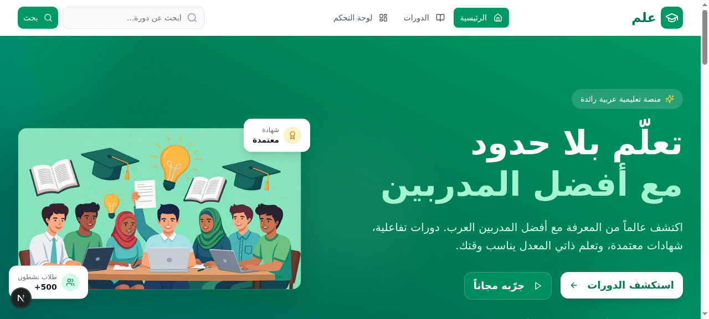
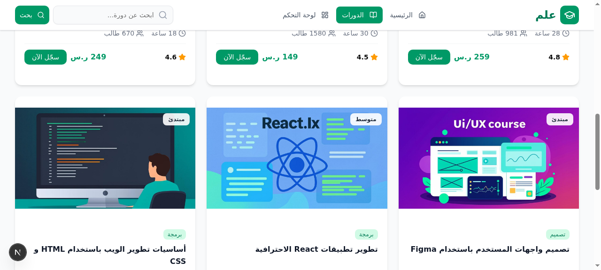
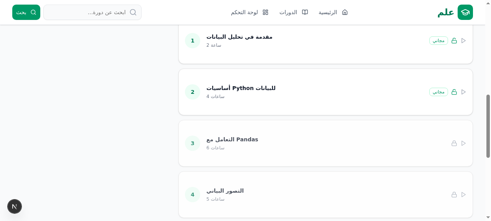
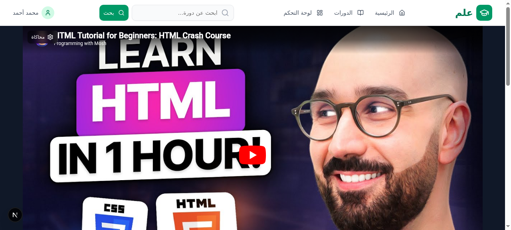
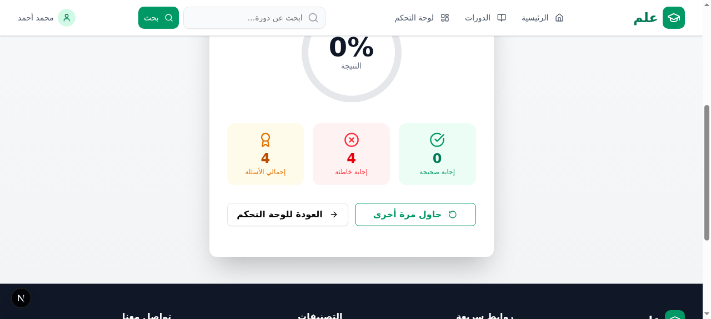
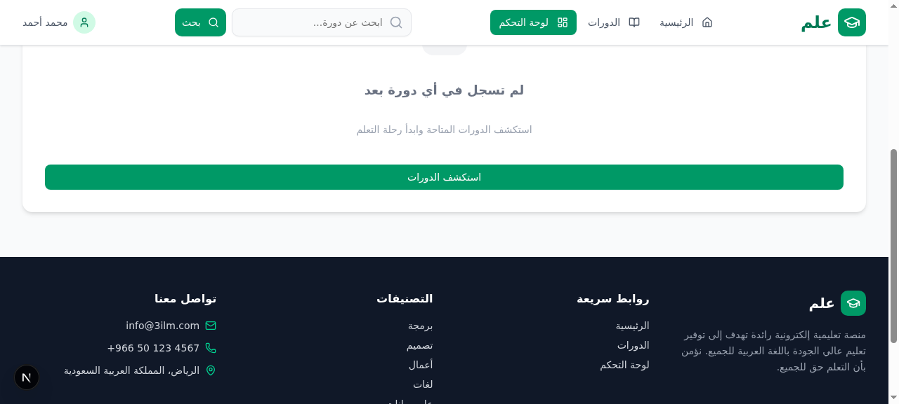

<div align="center">

# 🎓 علم — 3ilm

### منصة تعليمية إلكترونية متكاملة باللغة العربية

[](https://nextjs.org/)
[](https://www.typescriptlang.org/)
[](https://www.prisma.io/)
[](https://tailwindcss.com/)
[](./LICENSE)

</div>

---

## 📸 معاينة المشروع

<table>
  <tr>
    <td align="center"><b>الصفحة الرئيسية</b></td>
    <td align="center"><b>صفحة الدورات</b></td>
  </tr>
  <tr>
    <td></td>
    <td></td>
  </tr>
  <tr>
    <td align="center"><b>تفاصيل الدورة</b></td>
    <td align="center"><b>مشاهدة الدرس</b></td>
  </tr>
  <tr>
    <td></td>
    <td></td>
  </tr>
  <tr>
    <td align="center"><b>نتيجة الاختبار</b></td>
    <td align="center"><b>لوحة التحكم</b></td>
  </tr>
  <tr>
    <td></td>
    <td></td>
  </tr>
</table>

---

## ✨ المميزات

### 🎯 تجربة تعليمية متكاملة
- **دورات فيديو تفاعلية** — مشغل فيديو مدمج مع دعم YouTube وتشغيل محاكى
- **اختبارات تفاعلية** — نظام اختبارات شامل مع مؤقت تنازلي وشرح للإجابات
- **تتبع التقدم** — متابعة تقدم الطالب في كل دورة بنسبة مئوية
- **شهادات إتمام** — إنشاء شهادات تلقائياً عند اجتياز الاختبار مع إمكانية الطباعة

### 🎨 واجهة مستخدم احترافية
- **تصميم RTL كامل** — واجهة عربية بالكامل مع دعم اتجاه الكتابة من اليمين لليسار
- **انتقالات سلسة** — حركات انتقالية بين الصفحات باستخدام Framer Motion
- **تصميم متجاوب** — يعمل بشكل ممتاز على جميع أحجام الشاشات
- **تصميم بألوان زمردية** — هوية بصرية متميزة بلون أخضر زمردي

### 📊 لوحة تحكم متقدمة
- **رسوم بيانية تفاعلية** — باستخدام Recharts (BarChart, PieChart, AreaChart)
- **إحصائيات شاملة** — عدد الدورات، الشهادات، ساعات التعلم
- **تتبع النشاط الأسبوعي** — عرض نشاط التعلم خلال الأسبوع

### 🏗️ بنية تقنية قوية
- **إدارة حالة مركزية** — باستخدام Zustand
- **قاعدة بيانات علائقية** — Prisma ORM مع SQLite
- **API Routes** — واجهة برمجة تطبيقات RESTful كاملة
- **مكونات UI قابلة لإعادة الاستخدام** — باستخدام shadcn/ui

---

## 🛠️ التقنيات المستخدمة

| الفئة | التقنية |
|-------|---------|
| **إطار العمل** | Next.js 16 (App Router) |
| **اللغة** | TypeScript 5 |
| **التصميم** | Tailwind CSS 4 + shadcn/ui |
| **قاعدة البيانات** | Prisma ORM + SQLite |
| **إدارة الحالة** | Zustand |
| **الحركات** | Framer Motion |
| **الرسوم البيانية** | Recharts |
| **الأيقونات** | Lucide React |
| **الإشعارات** | Sonner |
| **تأثيرات الاحتفال** | Canvas Confetti |

---

## 🚀 البدء السريع

### المتطلبات الأساسية

- Node.js 18+ أو Bun
- npm أو bun أو yarn

### التثبيت

```bash
# استنساخ المشروع
git clone https://github.com/youssef-ai-dev/education-platform.git

# الدخول لمجلد المشروع
cd education-platform

# تثبيت التبعيات
npm install

# إعداد قاعدة البيانات
npx prisma generate
npx prisma db push

# تشغيل الخادم المحلي
npm run dev
```

افتح المتصفح على [http://localhost:3000](http://localhost:3000)

> 💡 **ملاحظة:** البيانات التجريبية يتم إنشاؤها تلقائياً عند أول تشغيل عبر `/api/seed`

---

## 📁 هيكل المشروع

```
src/
├── app/
│   ├── api/                    # واجهات برمجة التطبيقات
│   │   ├── courses/            # مسارات الدورات (GET, POST)
│   │   ├── enrollments/        # مسارات التسجيل (GET, POST, PATCH)
│   │   ├── quiz-attempts/      # مسارات اختبارات (POST)
│   │   ├── certificates/       # مسارات الشهادات (GET)
│   │   ├── generate-certificate/ # إنشاء شهادة (POST)
│   │   ├── progress/           # تحديث التقدم (PATCH)
│   │   └── seed/               # بيانات تجريبية (POST)
│   ├── globals.css             # الأنماط العامة
│   ├── layout.tsx              # التخطيط الرئيسي
│   └── page.tsx                # الصفحة الرئيسية
│
├── components/
│   ├── layout/
│   │   ├── Header.tsx          # شريط التنقل العلوي
│   │   └── Footer.tsx          # التذييل
│   ├── views/
│   │   ├── HomeView.tsx        # الصفحة الرئيسية
│   │   ├── CoursesView.tsx     # صفحة الدورات
│   │   ├── CourseDetailView.tsx # تفاصيل الدورة
│   │   ├── LessonView.tsx      # مشاهدة الدرس
│   │   ├── QuizView.tsx        # الاختبار التفاعلي
│   │   ├── QuizResultView.tsx  # نتيجة الاختبار
│   │   ├── DashboardView.tsx   # لوحة التحكم
│   │   └── CertificateView.tsx # الشهادة
│   ├── ui/                     # مكونات shadcn/ui
│   └── PageTransition.tsx      # مكون الانتقالات
│
├── store/
│   └── useAppStore.ts          # إدارة الحالة (Zustand)
│
└── prisma/
    └── schema.prisma           # مخطط قاعدة البيانات
```

---

## 📡 واجهة برمجة التطبيقات (API)

| المسار | الطريقة | الوصف |
|--------|---------|-------|
| `/api/courses` | `GET` | جلب جميع الدورات مع فلترة |
| `/api/courses/[id]` | `GET` | جلب تفاصيل دورة محددة |
| `/api/enrollments` | `GET` | جلب تسجيلات الطالب |
| `/api/enrollments` | `POST` | التسجيل في دورة جديدة |
| `/api/enrollments/[id]` | `PATCH` | تحديث تقدم التسجيل |
| `/api/quiz-attempts` | `POST` | حفظ نتيجة اختبار |
| `/api/certificates` | `GET` | جلب شهادات الطالب |
| `/api/certificates/[id]` | `GET` | جلب شهادة محددة |
| `/api/generate-certificate` | `POST` | إنشاء شهادة إتمام |
| `/api/seed` | `POST` | إنشاء بيانات تجريبية |

---

## 🗄️ مخطط قاعدة البيانات

```
Course ──┬── Lesson ────── Quiz ── QuizQuestion
         │                      │
         ├── Enrollment ─┬── QuizAttempt
         │               │
         │               └── Certificate
         │
         └── (thumbnailUrl, rating, studentsCount, price, level)
```

---

## 🌐 تدفق التطبيق

```
الرئيسية → تصفح الدورات → تفاصيل الدورة → التسجيل
                                            ↓
                                   مشاهدة الدروس → إكمال الدرس
                                            ↓
                                   الاختبار التفاعلي → النتيجة
                                            ↓
                               (نجاح) → إنشاء شهادة → عرض/طباعة الشهادة
                               (رسوب) → إعادة المحاولة
```

---

## 📄 الرخصة

هذا المشروع مرخص تحت رخصة MIT — راجع ملف [LICENSE](./LICENSE) للتفاصيل.

---

<div align="center">

**صُنع بـ ❤️ بواسطة [Youssef](https://github.com/youssef-ai-dev)**

[](https://github.com/youssef-ai-dev)

</div>
